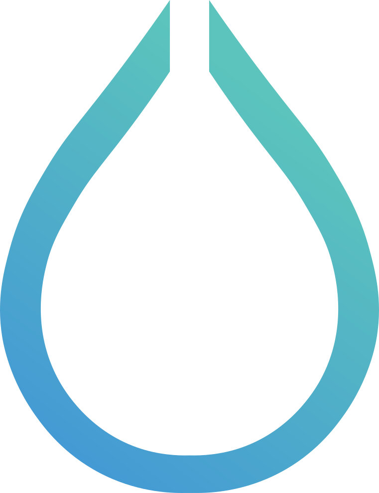

<!-- 
-->
# 👾 hyprcow 🐮
🎩 Hacker of aesthetics | 🐧 Penguinologist en Jefe |  Hyprland Evangelist |  Neo-Gentooist

🧠 Welcome to my chaotic digital lair. I rice cursors (for now, one has to start somewhere). I break stuff. I learn by fire.

- 🧪 Currently building [Hyprland Logo Cursor Theme](https://github.com/hyprcow/hyprland_theme)
- ✍️ Writing wild stuff at [Penguinology Blog](https://penguinology1.wordpress.com/)
- 👽 Mugandis al-Linux: Seeker of forbidden dotfiles. Architect of digital ruminants.  
Channeling the spirit of Dune’s Mentats, Alien’s Engineers, and Bash’s `$PS1`.  
*Rebooting on the edge of /dev/null.*
- 🧠 Masterplan: Make Gentoo Sexy Again™ & start a ricing revolution

- 🐄 Star the [Hyprland Theme](https://github.com/hyprcow/hyprland_theme) repo if you vibe with the chaos
- 📨 Got ideas? Drop me a note or a weird cow emoji on [Mastodon](#) or [Reddit](#)

<!--
**JBluemchen80/JBluemchen80** is a ✨ _special_ ✨ repository because its `README.md` (this file) appears on your GitHub profile.

Here are some ideas to get you started:

- 🔭 I’m currently working on ...
- 🌱 I’m currently learning ...
- 👯 I’m looking to collaborate on ...
- 🤔 I’m looking for help with ...
- 💬 Ask me about ...
- 📫 How to reach me: ...
- 😄 Pronouns: ...
- ⚡ Fun fact: ...
-->
